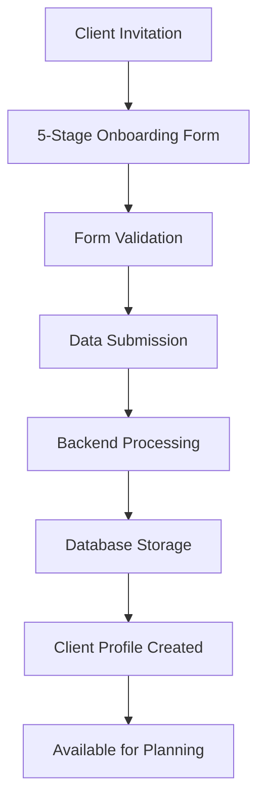
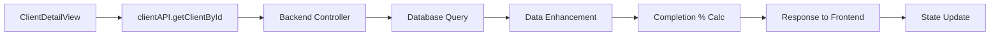
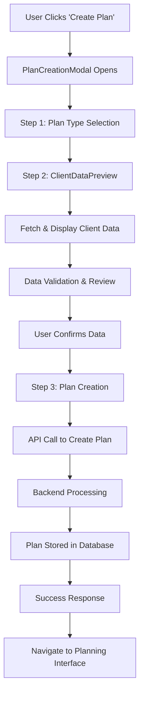
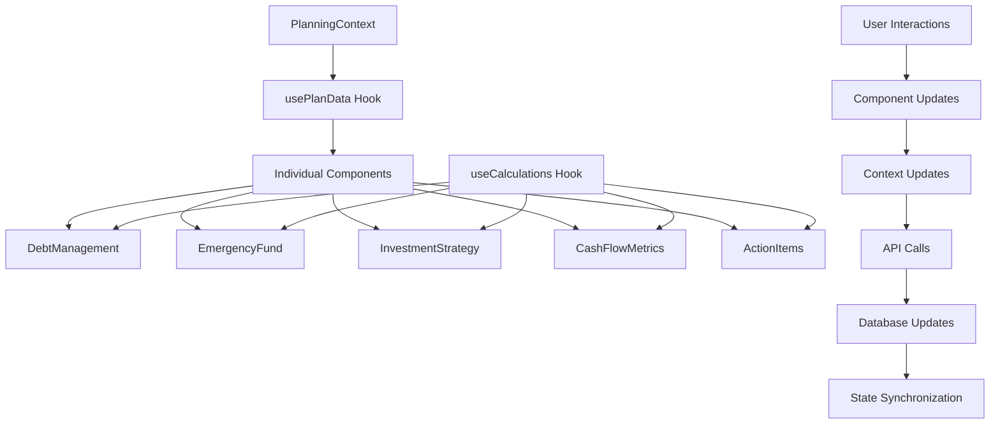
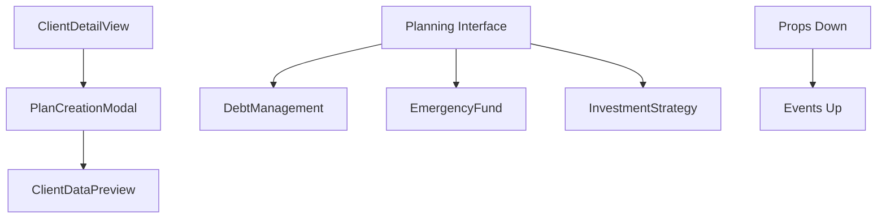
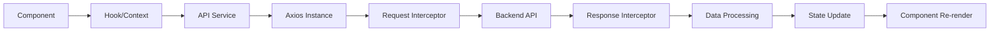
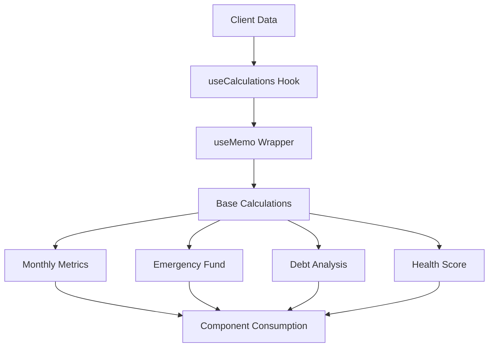
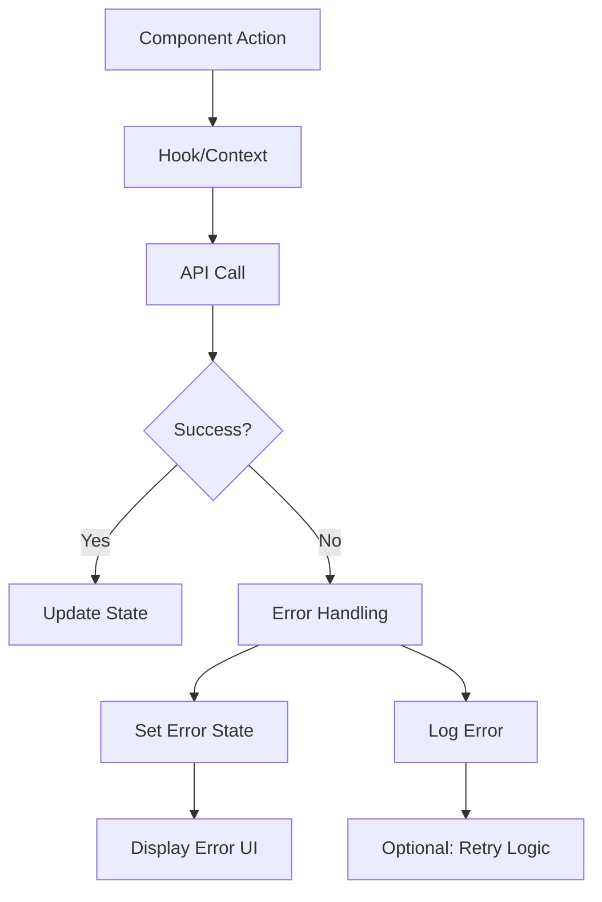

# Data Flow & Integration Patterns

## 📋 Table of Contents
- [Overview](#overview)
- [Client Data Flow](#client-data-flow)
- [Planning System Data Flow](#planning-system-data-flow)
- [Component Communication](#component-communication)
- [State Management Patterns](#state-management-patterns)
- [API Integration](#api-integration)
- [Calculation Pipeline](#calculation-pipeline)
- [Error Handling](#error-handling)

## 🌊 Overview

The RicheAI system follows a unidirectional data flow pattern with centralized state management and component-based architecture. Data flows from the backend through API services, into React context/hooks, and down to individual components.

## 📊 Client Data Flow

### 1. Client Onboarding Flow


**Implementation:**
```javascript
// Onboarding submission
const response = await clientAPI.submitOnboardingForm(token, formData);

// Data structure
const clientData = {
  personalInfo: { firstName, lastName, email, ... },
  financialInfo: { totalMonthlyIncome, totalMonthlyExpenses, ... },
  assets: { investments: {...}, cashBankSavings: ... },
  debtsAndLiabilities: { homeLoan: {...}, personalLoan: {...} },
  retirementPlanning: { retirementAge, targetCorpus, ... },
  enhancedRiskProfile: { riskTolerance, investmentExperience, ... }
}
```

### 2. Client Data Retrieval


**Data Enhancement Process:**
```javascript
// Backend enhancement
const enhancedClient = {
  ...rawClientData,
  completionPercentage: calculateCompletionPercentage(rawClientData),
  calculatedFinancials: {
    monthlySurplus: monthlyIncome - monthlyExpenses,
    savingsRate: (surplus / income) * 100,
    emiRatio: (totalEMIs / income) * 100
  },
  portfolioSummary: casData ? generatePortfolioSummary(casData) : null
}
```

## 🎯 Planning System Data Flow

### 1. Plan Creation Flow


**Code Implementation:**
```javascript
// PlanCreationModal.jsx
const handleDataReviewed = (data) => {
  setReviewedClientData(data);
  handleNext(); // Move to creation step
};

const handleCreatePlan = async () => {
  const response = await planAPI.createPlan({
    clientId,
    planType: selectedPlanType
  });
  onPlanCreated(response.plan);
};
```

### 2. Component Data Flow


**Hook Integration:**
```javascript
// Component implementation
function DebtManagement({ clientId, planId }) {
  // Data management
  const { planData, updatePlanSection } = usePlanData(planId, clientId);
  
  // Calculations
  const { prioritizedDebts, monthlyMetrics } = useCalculations(clientData);
  
  // Local state
  const [editMode, setEditMode] = useState(false);
  
  // Update handler
  const handleUpdate = async (updates) => {
    await updatePlanSection('debtManagement', updates);
  };
}
```

## 🔄 Component Communication

### 1. Parent-Child Communication


**Props Pattern:**
```javascript
// Parent component
<DebtManagement
  clientData={clientData}
  planData={planData}
  onUpdate={handlePlanUpdate}
/>

// Child component
const DebtManagement = ({ clientData, planData, onUpdate }) => {
  const handleDebtUpdate = (updates) => {
    onUpdate('debtManagement', updates);
  };
};
```

### 2. Context-Based Communication
```javascript
// Provider level
<PlanningProvider>
  <PlanningInterface />
</PlanningProvider>

// Consumer components
const DebtManagement = () => {
  const {
    clientData,
    planData,
    updatePlanSection,
    setEditMode
  } = usePlanning();
  
  // Component logic
};
```

## 🏪 State Management Patterns

### 1. Context State Structure
```javascript
const planningState = {
  // Core data
  clientData: {
    personalInfo: {...},
    financialInfo: {...},
    assets: {...},
    debtsAndLiabilities: {...}
  },
  
  planData: {
    planType: 'cash_flow',
    status: 'draft',
    planDetails: {
      cashFlowPlan: {
        debtManagement: {...},
        emergencyFundStrategy: {...},
        investmentRecommendations: {...}
      }
    }
  },
  
  // UI state
  activeSection: 'overview',
  editMode: false,
  saving: false,
  
  // Cached calculations
  calculatedMetrics: {
    monthlyMetrics: {...},
    healthScore: 75,
    emergencyFund: {...}
  },
  
  // Form state
  formData: {},
  actionItems: []
}
```

### 2. State Update Patterns
```javascript
// Optimistic updates
const updatePlanSection = async (section, updates) => {
  // Update local state immediately
  dispatch({
    type: 'UPDATE_PLAN_SECTION',
    section,
    payload: updates
  });
  
  // Sync with backend
  try {
    const response = await planAPI.updatePlan(planId, {
      planDetails: {
        ...planData.planDetails,
        [section]: { ...planData.planDetails[section], ...updates }
      }
    });
    
    // Update with server response
    dispatch({ type: 'SET_PLAN_DATA', payload: response.plan });
  } catch (error) {
    // Revert on error
    dispatch({ type: 'REVERT_PLAN_SECTION', section });
    throw error;
  }
};
```

## 🔌 API Integration

### 1. API Service Layer
```javascript
// services/api.js
export const planAPI = {
  createPlan: async (planData) => {
    const response = await api.post('/plans', planData);
    return response.data;
  },
  
  updatePlan: async (planId, updates) => {
    const response = await api.put(`/plans/${planId}`, updates);
    return response.data;
  },
  
  getPlanById: async (planId) => {
    const response = await api.get(`/plans/${planId}`);
    return response.data;
  }
};
```

### 2. Request/Response Flow


**Interceptor Implementation:**
```javascript
// Request interceptor
api.interceptors.request.use((config) => {
  const token = localStorage.getItem('token');
  if (token) {
    config.headers.Authorization = `Bearer ${token}`;
  }
  
  config.metadata = {
    startTime: new Date(),
    requestId: `REQ_${Date.now()}_${Math.random().toString(36).substr(2, 9)}`
  };
  
  return config;
});

// Response interceptor
api.interceptors.response.use(
  (response) => {
    const duration = new Date() - response.config.metadata.startTime;
    console.log(`API Response [${response.config.metadata.requestId}]: ${duration}ms`);
    return response;
  },
  (error) => {
    if (error.response?.status === 401) {
      localStorage.removeItem('token');
      window.location.href = '/login';
    }
    return Promise.reject(error);
  }
);
```

## ⚡ Calculation Pipeline

### 1. Calculation Flow


**Memoization Strategy:**
```javascript
// useCalculations.js
export const useCalculations = (clientData) => {
  // Monthly metrics with dependency tracking
  const monthlyMetrics = useMemo(() => {
    if (!clientData) return null;
    return calculateMonthlyMetrics(clientData);
  }, [clientData]);

  // Emergency fund calculation
  const emergencyFund = useMemo(() => {
    if (!clientData) return null;
    return calculateEmergencyFund(clientData);
  }, [clientData]);

  // Health score with multiple dependencies
  const healthScore = useMemo(() => {
    if (!clientData || !monthlyMetrics) return 0;
    return calculateFinancialHealthScore(clientData, monthlyMetrics);
  }, [clientData, monthlyMetrics]);

  // Return all calculations
  return {
    monthlyMetrics,
    emergencyFund, 
    healthScore,
    // ... other calculations
  };
};
```

### 2. Calculation Dependencies
```javascript
// Dependency chain
clientData -> monthlyMetrics -> healthScore -> actionItems
                            \-> emergencyFund -> investmentCapacity
                            \-> debtAnalysis -> prioritizedDebts
```

## 🚨 Error Handling

### 1. Error Propagation Pattern


**Error Handling Implementation:**
```javascript
// usePlanData.js
const updatePlan = useCallback(async (updates) => {
  try {
    setState(prev => ({ ...prev, error: null, saving: true }));
    const response = await planAPI.updatePlan(planId, updates);
    setState(prev => ({
      ...prev,
      planData: response.plan,
      saving: false,
      lastUpdated: new Date()
    }));
    return response.plan;
  } catch (error) {
    const errorMessage = error.response?.data?.error || 'Failed to update plan';
    setState(prev => ({
      ...prev,
      error: errorMessage,
      saving: false
    }));
    throw error; // Re-throw for component handling
  }
}, [planId]);

// Component error handling
const handleUpdate = async () => {
  try {
    await updatePlan(formData);
    toast.success('Plan updated successfully');
  } catch (error) {
    toast.error(`Update failed: ${error.message}`);
  }
};
```

### 2. Error Boundaries
```javascript
// ErrorBoundary component
class PlanningErrorBoundary extends React.Component {
  constructor(props) {
    super(props);
    this.state = { hasError: false, error: null };
  }

  static getDerivedStateFromError(error) {
    return { hasError: true, error };
  }

  componentDidCatch(error, errorInfo) {
    console.error('Planning Error:', error, errorInfo);
    // Send to error tracking service
  }

  render() {
    if (this.state.hasError) {
      return (
        <Alert severity="error">
          <Typography variant="h6">Something went wrong</Typography>
          <Typography variant="body2">
            There was an error in the planning interface. Please refresh the page.
          </Typography>
        </Alert>
      );
    }

    return this.props.children;
  }
}
```

## 📈 Performance Considerations

### 1. Optimization Techniques
- **Memoization**: Expensive calculations cached with useMemo
- **Component Splitting**: Large components broken into smaller ones
- **Lazy Loading**: Components loaded on demand
- **Context Optimization**: Multiple contexts to prevent unnecessary re-renders

### 2. Data Loading Strategy
```javascript
// Concurrent data loading
useEffect(() => {
  const loadData = async () => {
    const promises = [];
    if (planId) promises.push(loadPlan());
    if (clientId) promises.push(loadClient());
    
    try {
      await Promise.all(promises); // Load in parallel
    } catch (error) {
      console.error('Error loading data:', error);
    }
  };
  
  loadData();
}, [planId, clientId]);
```

This comprehensive data flow architecture ensures reliable, performant, and maintainable data management across the RicheAI planning system.